# TryHackMe: Metasploit — Meterpreter

**Path:** Cyber Security 101 → Exploitation Basics → Metasploit: Meterpreter
**Difficulty:** Premium room
**Focus:** In-memory payloads, Meterpreter's architecture, core post-exploitation commands, and credential/data extraction

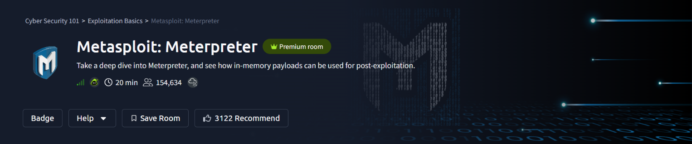

**Meterpreter** is Metasploit's flagship post-exploitation payload — an in-memory agent that gives an attacker a rich, interactive command-and-control interface on a compromised host without ever touching disk. This room breaks down how it works under the hood and puts its core commands to use for real post-exploitation tasks.

---

## Task 2 — What Is Meterpreter?

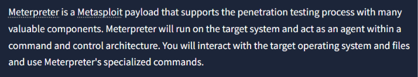

Meterpreter is a Metasploit payload that acts as an **agent** within a command-and-control architecture — once it's running on the target, it gives the attacker a specialized command set for interacting with the compromised system's files, processes, and network.

### Why It's Hard to Detect

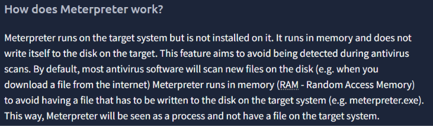

The key design choice that makes Meterpreter so evasive: it **runs entirely in memory (RAM)** and is never written to disk on the target. Since most antivirus engines scan files as they're written to disk, a payload that never touches the filesystem largely sidesteps that detection layer — it appears as a running process, not a file.

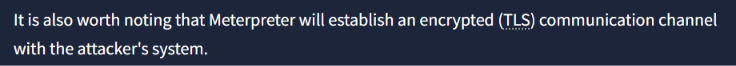

On top of that, Meterpreter establishes an **encrypted (TLS) communication channel** back to the attacker's machine, protecting the command-and-control traffic itself from casual network inspection.

### Staged vs. Inline Payloads

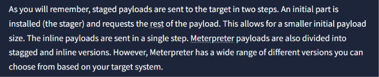

Meterpreter payloads come in two delivery flavors:

- **Staged** — a small initial stager is delivered first, which then pulls down the rest of the payload. This keeps the initial delivery size small, which can matter when working with size-constrained exploits.
- **Inline** — the entire payload is delivered in a single shot.

### Choosing the Right Meterpreter Variant

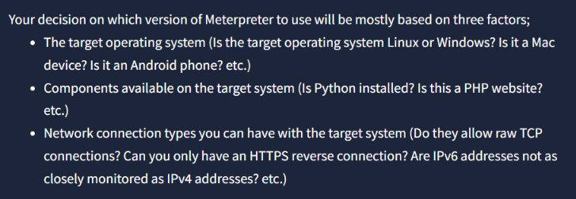

Picking the correct Meterpreter build comes down to three factors: the **target OS** (Windows/Linux/macOS/Android), what **components are already available** on the target (e.g., is Python installed? Is it a PHP web app?), and what **network connection types** are actually usable against the target (raw TCP vs. HTTPS-only, IPv4 vs. IPv6 monitoring, etc.).

---

## Task 3 — Meterpreter's Command Categories

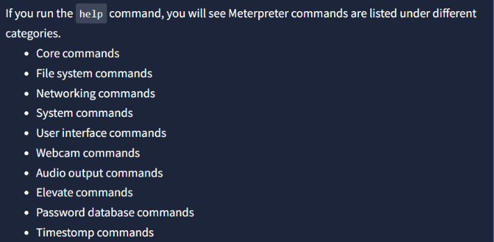

Running `help` inside an active session reveals Meterpreter's full command set, organized into categories covering everything from core session control to file system access, networking, webcam/audio capture, privilege elevation, and password database extraction.

### Core Commands

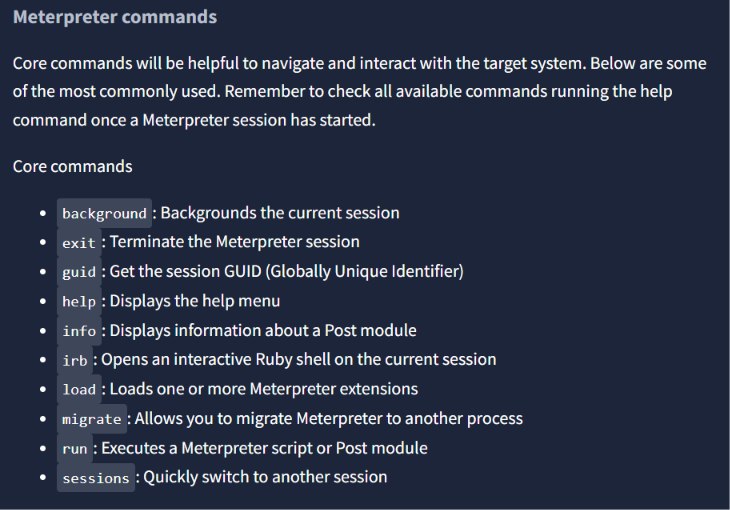

A handful of these come up constantly during any session:

| Command | Purpose |
|---|---|
| `background` | Backgrounds the current session without killing it |
| `exit` | Terminates the Meterpreter session |
| `guid` | Retrieves the session's Globally Unique Identifier |
| `help` | Displays the full help menu |
| `info` | Shows details about a Post module |
| `irb` | Opens an interactive Ruby shell on the session |
| `load` | Loads additional Meterpreter extensions |
| `migrate` | Moves Meterpreter to another running process |
| `run` | Executes a Meterpreter script or Post module |
| `sessions` | Switches between active sessions |

### Migrate

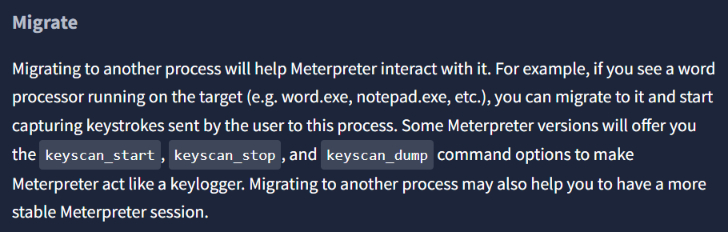

`migrate` lets Meterpreter jump into another running process — useful both for **stability** (moving off a process that might crash or get closed) and for **capability** (e.g., migrating into a word processor to start capturing keystrokes with `keyscan_start` / `keyscan_dump`).

### Hashdump

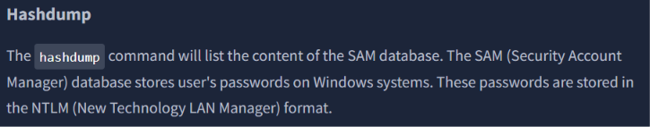

`hashdump` pulls the entire contents of the **SAM (Security Account Manager)** database — the Windows store of local user password hashes, kept in **NTLM** format.

---

## Task 4 — Practical: Post-Exploitation on a Live Target

With a Meterpreter session established on the target, it's time to put these commands to work.

### System Enumeration

```bash
meterpreter > sysinfo
```

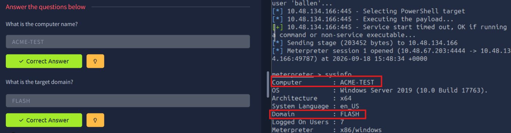

`sysinfo` immediately reveals the target's computer name, OS build (Windows Server 2019), architecture, and — critically — its Active Directory domain, giving an immediate sense of the environment being operated in.

### Migrating & Dumping Credentials

```bash
meterpreter > migrate 620
meterpreter > hashdump
```

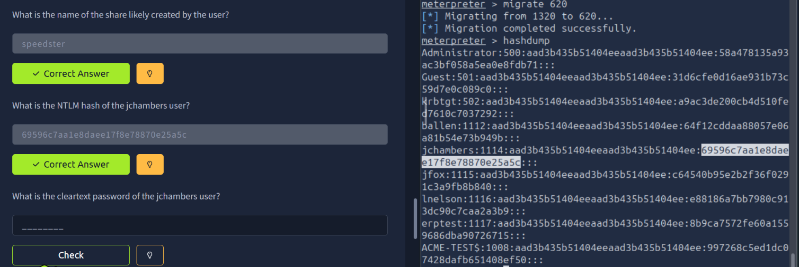

After migrating to a more stable process, `hashdump` spills the full SAM database — every local account's NTLM hash in one shot. This includes service accounts, the built-in Administrator/Guest/krbtgt entries, and multiple regular user accounts, any of which can now be taken offline for cracking (or, depending on the hash type, used directly in a pass-the-hash attack).

### Digging Through the Filesystem for Secrets

```bash
meterpreter > cat "c:\Program Files (x86)\Windows Multimedia Platform\secrets.txt"
```

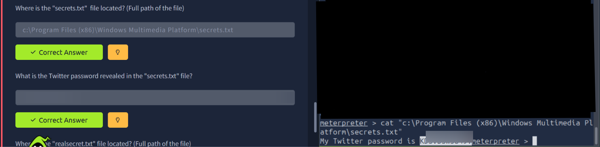

A quick filesystem crawl turns up a `secrets.txt` file tucked away in an unrelated program directory — a classic (and surprisingly common) example of sensitive credentials being left behind in plaintext files on a compromised host. *(Password redacted above — dig it up yourself!)*

The same technique is then applied to track down a second file elsewhere on the system:

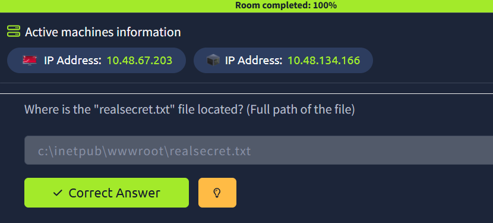

Following the exact same `search` → `cat` pattern used for `secrets.txt`, `realsecret.txt` turns up in the webroot — a reminder that a single successful technique is often reusable across an entire filesystem sweep once you know what you're looking for.

---

## Summary

| Step | Command | Outcome |
|---|---|---|
| Recon | `sysinfo` | Computer name, OS, and domain identified |
| Stability | `migrate <PID>` | Moved to a more stable target process |
| Credential dump | `hashdump` | Full SAM database — NTLM hashes for every local account |
| File hunting | `search` / `cat` | Uncovered plaintext credentials left on disk |

This room is a great practical companion to the earlier Metasploit rooms — instead of just gaining access, it demonstrates *what to actually do* once a Meterpreter session is live: enumerate the host, stabilize your foothold, dump every credential you can, and sweep the filesystem for anything else an careless user or admin may have left lying around.

---

*The plaintext password recovered from `secrets.txt` has been redacted from the screenshot — every command and technique is shown in full so you can reproduce the entire walkthrough yourself.*
